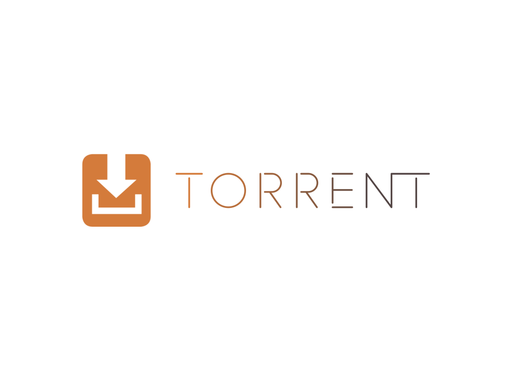
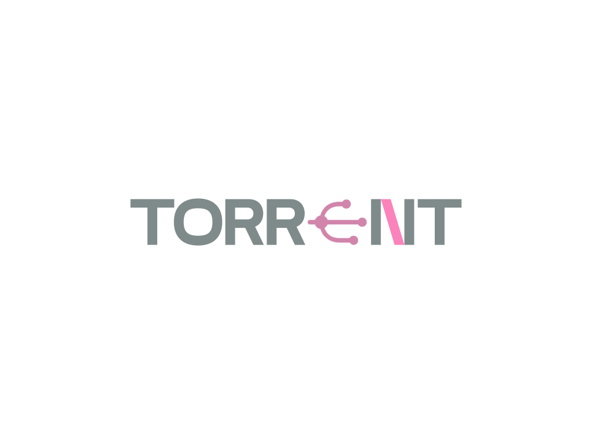

# torrent client with rust

inspired by
[tutorial](https://allenkim67.github.io/programming/2016/05/04/how-to-make-your-own-bittorrent-client.html)

## features
- bencode encoder
- bencode decoder

## TODO
- [x] bencode decoder
- [ ] bencode encoder
- [ ] get peers with tracker
    - [x] request udp connection
    - [ ] recieve peers
    - [ ] info hash
    - [ ] torretn size
- [ ] download
    - [ ] tcp connection
    - [ ] grouping
    - [ ] handshakes
    - [ ] managing connections and pieces
    - [ ] torretn size

## to fix
- [ ] encoder number come out as \u{7}