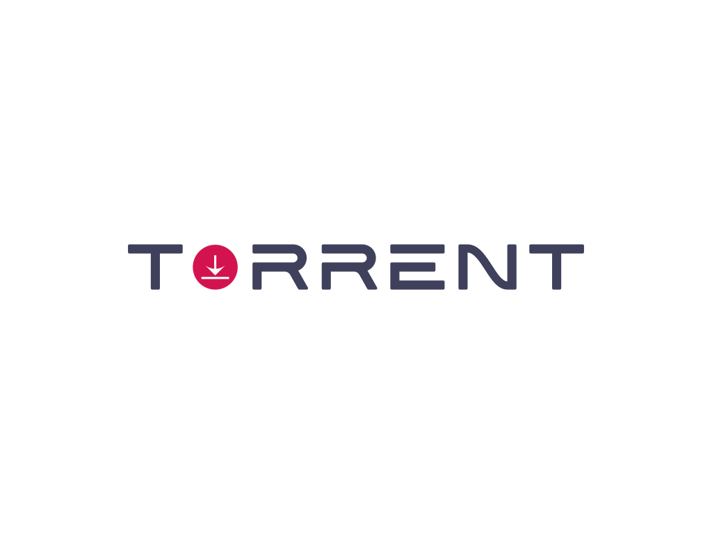

# torrent client with rust

sources

[tutorial in js](https://allenkim67.github.io/programming/2016/05/04/how-to-make-your-own-bittorrent-client.html)

[tutorial in go](https://blog.jse.li/posts/torrent/)

[torrent specification](https://wiki.theory.org/BitTorrentSpecification#piece:_.3Clen.3D0009.2BX.3E.3Cid.3D7.3E.3Cindex.3E.3Cbegin.3E.3Cblock.3E)

    

## notes
- copying the contents of a .torrent file doesn't work (idk why)
- copying the entire file then changing it's name is ok

## features
- NOTICE: this client only works with torrent files that have an announce url in them
- bencode encoder

## TODO
- [x] bencode decoder
- [x] parse torrent file
- [x] calculate info hash
- [x] get peers with tracker
- [ ] download
    - [x] tcp connection
    - [x] handshakes
    - [x] messages
    - [x] pieces
    - [x] managing connections and pieces
    - [x] downloading pieces
    - [ ] writing pieces to files

## extra features to implement
- [ ] recovery from all types of errors and disconnections (no unwraps in this app should be left)
- [ ] no reliance on announce (implementing DHT)
- [ ] magnet links
- [ ] when download is interupted pick off where it started 

## Errors:
- [ ] Resource temporarily unavailable (os error 11) ---> (message.rs line:107-y)
- [ ] failed to fill whole buffer ---> (message.rs line:127)
- [ ] Broken pipe (os error 32)
- [ ] insane CPU usage almost 100% (i5 8600k)

## to fix
- [ ] add documentation
- [ ] add all errors handling
- [ ] add all componenets tests